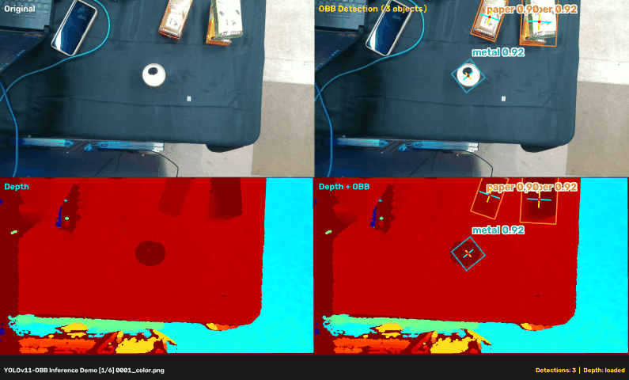
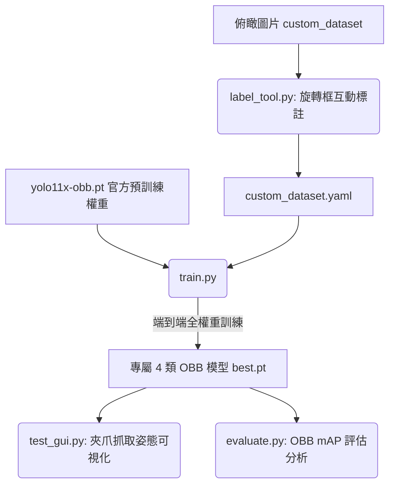

# AI Robotics - Garbage Classification & Grasping (YOLOv11-OBB)



這是一個專為**機器手臂夾爪 (Parallel Gripper)** 設計的 **YOLOv11-OBB (Oriented Bounding Box，旋轉邊界框)** 垃圾辨識與抓取姿態預測系統。

系統直接在機器人真實俯瞰視角（鳥瞰、純黑桌面）上進行端到端訓練，並輸出帶有**平面旋轉姿態角度 ($\text{Yaw}, \theta$)**、中心抓取點與長短軸的邊界框，提供機械手臂最即時且精準的抓取資訊。

---

## 專案工作流程 (Workflow)



---

## 專案分類與機械手臂抓取策略

模型輸出專為機器人夾取設計的 4 大類別：
- `0: plastic` (可回收塑膠：寶特瓶、手搖飲塑膠杯、布丁杯等)
- `1: metal` (可回收金屬：鋁罐、鐵罐、八寶粥罐、咖啡罐等)
- `2: paper` (可回收結構性紙容器：麥香鋁箔包、純喫茶新鮮屋紙盒、泡麵紙碗、便當紙盒等)
- `3: general_waste` (一般垃圾與非抓取目標：衛生紙團、廢紙屑/平鋪紙張、塑膠包裝袋、吸管等)

> 紙張歸類為一般垃圾：
> 1. **外觀紋理歧義 (Visual Ambiguity)**：從俯瞰視角看，揉成一團的紙屑與揉成一團的抽取式衛生紙在材質、反光與形狀上極難區分。
> 2. **夾爪物理抓取限制 (Gripper Physics Constraint)**：平行二指夾爪 (Parallel Gripper) 無法直接夾取平鋪於桌面上的薄紙張（缺少高度與夾取間隙），因此將平鋪紙張與不可回收物統一歸類為 `general_waste`。
> 3. **專注高價值回收容器**：將 `paper` 類別聚焦在具有立體結構與體積的**鋁箔包、紙盒與便當盒**，利於夾爪計算旋轉角度精確閉合夾取。

---

## 環境與安裝

1. **建立虛擬環境**
```bash
python3 -m venv .venv
source .venv/bin/activate  # Linux / macOS
# Windows: .venv\Scripts\activate
```

2. **安裝依賴套件**
```bash
pip install -r requirements.txt
```

---

## 核心工具與操作說明

### 1. 旋轉框標註與檢查工具 ([`label_tool.py`](label_tool.py))
專為機器人夾取任務打造的互動式 OBB 標註軟體，支援既有標籤無損讀入與即時旋轉編輯。
```bash
python label_tool.py
```
- **向下相容**：自動將舊有的 5 欄位水平標籤 (HBB) 載入為初始角度為 $0^\circ$ 的矩形。
- **選取框**：滑鼠左鍵點選框，顯示黃色旋轉手把與角落/邊緣拉伸節點。
- **旋轉角度**：
  - 拖曳頂部**黃色旋轉手把**。
  - 選取狀態下滾動**滑鼠滾輪**（或按 `R` / `E` / `[` / `]`）。
- **長寬拉伸**：拖曳角落或邊緣小方塊（嚴格維持 90 度矩形幾何）。
- **切換類別**：按鍵盤數字鍵 `0` ~ `3` 即時切換。
- **刪除標籤**：按鍵盤 `Delete` / `Backspace` / `X` 或滑鼠右鍵點擊。
- **切換資料集**：按 `T` 鍵可在 `train` 與 `test` 資料夾間無縫切換。
- **換頁與儲存**：`A` (上一張), `D` / `Space` (下一張並自動儲存), `Q` (儲存退出)。

### 2. 端到端 OBB 訓練 ([`train.py`](train.py))
直接以 `yolo11x-obb.pt` 為基底，在 `custom_dataset` 進行 300 輪全權重訓練。
```bash
python train.py
```

### 3. 圖形化推論與夾爪姿態測試 ([`test_gui.py`](test_gui.py))
即時預測 OBB 旋轉框，支援跨類別 Agnostic NMS 消除重複，並可視化展示夾爪抓取輔助線與角度文字（Yaw $\theta$）。
```bash
python test_gui.py [--path <images_dir>] [--fx FLOAT] [--fy FLOAT] [--cx FLOAT] [--cy FLOAT]
```
- **資料夾下拉選單**：左側欄可以切換要載入圖片的資料夾（自動列出 `custom_dataset/` 下所有含圖目錄）、「Load Random Image」與選檔皆以目前選定資料夾為準。
- **2×2 四格顯示**：左上＝原圖、右上＝OBB 標注、左下＝JET 深度原圖、右下＝深度＋同一組 OBB 標注。下方兩格只在圖片旁存在對應 `{stem}_depth.npy`（uint16, mm）或 `{stem}_depth_jet.png` 時出現；舊資料（無 depth）維持上方 1×2。支援 `capture_dataset.py` 的 `NNNN_color.png ↔ NNNN_depth.*` 命名配對；深度檔由該工具拍照產生（見 §7）。
- **hover-to-inspect**：滑鼠移到「右上／右下」偵測框上，該框以類別色半透明高亮並浮出資訊卡：
  - `pos` — OBB 中心的 3D 相機座標（**camera frame**，單位 cm）；x 向右、y **向下**（OpenCV 慣例）、z 沿光軸為物體距離。由中心點中值深度 + 針孔反投影（公式與 `robot_utils/pose_estimator.py` 相同）。餵手臂前還需乘 cam→base 外參。
  - `angle` — OBB yaw $\theta$（deg），夾爪垂直長軸閉合時以此對齊。
  - `grip` — **實際可夾寬度 (mm)**：取 OBB 較短那條邊（夾爪閉合側）的兩端點，各量 9×9 patch 中值深度反投影成 3D 點後取歐氏距離。無 depth 時退化為像素短邊長並標 `(no depth)`。
- **depth probe**：滑鼠移到「左下 Depth」整格、或「右下 Depth+OBB 框外區域」，顯示該點的 raw depth（mm）。
- **內參覆蓋**：`--fx/--fy` 預設 920（D415 1280×720 未存 camera_info 時的合理值）、`--cx/--cy` 預設影像中心；有存 camera_info 時可傳入精確值。

### 4. 模型評估與 mAP 分析 ([`evaluate.py`](evaluate.py))
自動檢測模型為 OBB 或 HBB，並在測試集上計算 Precision, Recall, mAP@50 與 mAP@50-95。
```bash
python evaluate.py
```

### 5. AI 半自動預標註工具 ([`auto_label.py`](auto_label.py))
一鍵使用當前最佳的 `best.pt` 模型為所有新加入、尚未標註的照片自動產生初始 OBB 旋轉框，減少手動標註時間。
```bash
python auto_label.py
```

### 6. 展示動圖產生器 ([`make_demo_gif.py`](make_demo_gif.py))
一鍵將測試集預測結果輸出為每幀 1 秒的高畫質展示動圖 `demo.gif`。
```bash
python make_demo_gif.py
```

### 7. RealSense 拍照工具（RGB + aligned depth 配對）([`capture_dataset.py`](capture_dataset.py))
相機已起（`dual_amm dual_amm_arm_core.launch.py`）的狀態下，一鍵存下同一物理幀的 RGB 與對齊深度圖，作為訓練／演示用的離線資料。存檔自動遞增編號、不覆蓋：
```bash
# ⚠️ 用「系統 python」＋ source ROS；.venv 沒有灌 rclpy
source /opt/ros/humble/setup.bash
python3 capture_dataset.py --side left        # 或 --side right
# 預設存到 custom_dataset/demo/captures/，可用 --save-dir 指定其他路徑
```
每次按 Enter 拍一張（需 color 與 aligned depth 兩路都收到才存，收不到會提示重試），`q`+Enter 或 Ctrl-C 結束。輸出：
- `NNNN_color.png` — 原始 RGB
- `NNNN_depth.npy` — 原始 uint16 mm（零損耗，0 = 無效點）
- `NNNN_depth_jet.png` — JET 熱圖預覽

拍下後直接開 `test_gui.py`，資料夾選單挑 `custom_dataset/demo/captures` 就能看到 2×2 四格（RGB＋OBB 框＋深度＋深度標注）。topic 來源：
`/arm/camera_{side}/realsense_camera_{side}/color/image_raw` 與 `/arm/camera_{side}/realsense_camera_{side}/aligned_depth_to_color/image_raw`（16UC1, mm）。

---

## 授權聲明 (License)
- 本專案程式碼採用 MIT License 授權。
- 資料集標註採用 CC BY 4.0 授權。
