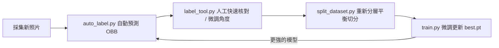

# 機器手臂垃圾分類與抓取 (YOLOv11-OBB) 專案演進與學習筆記

這份筆記記錄了本專案從最初的水平框 (HBB) 概念驗證，到克服機械手臂夾爪物理限制、全面遷移為旋轉框 (OBB)、精煉類別定義、資料集分層重構、超參數調優與 AI 閉環標註的完整迭代歷程。

---

## 🧭 目錄
1. [第一階段：起步與概念驗證 (HBB 基準與兩階段嘗試)](#第一階段起步與概念驗證-hbb-基準與兩階段嘗試)
2. [第二階段：重大典範轉移 —— 走向 YOLOv11-OBB 旋轉框](#第二階段重大典範轉移--走向-yolov11-obb-旋轉框)
3. [第三階段：類別定義的工程重構 (結合夾爪物理限制)](#第三階段類別定義的工程重構-結合夾爪物理限制)
4. [第四階段：資料集架構升級 (分層抽樣與嚴格三切分)](#第四階段資料集架構升級-分層抽樣與嚴格三切分)
5. [第五階段：超參數實驗與效能調優 (A/B 測試)](#第五階段超參數實驗與效能調優-ab-測試)
6. [第六階段：閉環 AI 半自動標註與工程化完善](#第六階段閉環-ai-半自動標註與工程化完善)
7. [核心經驗總結與未來展望](#核心經驗總結與未來展望)

---

## 第一階段：起步與概念驗證 (HBB 基準與兩階段嘗試)

### 1. 初始背景與做法
* **任務目標**：利用最新 YOLOv11 進行垃圾分類辨識。
* **資料來源**：最初採用公開 Kaggle 垃圾分類資料集，並輔以 AI 生成圖片進行擴充。
* **模型與標籤**：使用傳統的**水平邊界框 (Horizontal Bounding Box, HBB)**，輸出格式為標準的 `(class, x_center, y_center, width, height)`。
* **訓練流程**：採用兩階段微調腳本 (`convert_labels.py` + Kaggle 兩階段腳本 + `finetune.py`)，先在大規模公開資料集預訓練，再微調到目標場景。

### 2. 遭遇的痛點與問題
1. **夾爪無法抓取 (缺少旋轉姿態)**：
   * 在真實環境中，機械手臂俯瞰工作台（黑色桌面），平行夾爪 (Parallel Gripper) 要夾取斜放的寶特瓶、鋁箔包時，HBB 只能給出正矩形包圍盒，**無法提供物體的平面旋轉角度 ($\text{Yaw}, \theta$) 與長短軸方向**。若強行依照 HBB 中心夾取，夾爪經常會夾空或撞毀物體。
2. **Domain Gap (領域差距)**：
   * Kaggle 與網路圖片的視角、光影、背景雜訊，與機器手臂頂置相機（Top-down / Bird's-eye View）俯瞰純黑背景的真實場景存在極大差距。

---

## 第二階段：重大典範轉移 —— 走向 YOLOv11-OBB 旋轉框

為了根本解決機器手臂夾取的角度問題，專案進行了核心架構的重大升級：**從 HBB 全面遷移至 OBB (Oriented Bounding Box)**。

```mermaid
graph LR
    subgraph 舊架構_HBB
    A[HBB 正矩形] --> B[僅 (x, y, w, h)] --> C[夾爪未知旋轉角度導致夾取失敗]
    end
    subgraph 新架構_OBB
    D[OBB 旋轉矩形] --> E[4 頂點坐標 (x1,y1...x4,y4)] --> F[解析中心點 / 長短軸 / Yaw θ 角度] --> G[平行夾爪精準對位閉合]
    end
```

### 1. 備份與轉換
* 在 commit `7d0b451` 封存備份 HBB 基準線，隨後全面切入 OBB。
* 標籤格式全面改為 YOLO-OBB 標準的 9 欄位格式（正規化 4 個頂點坐標）：
  $$\text{class } x_1\ y_1\ x_2\ y_2\ x_3\ y_3\ x_4\ y_4$$

### 2. 自製互動式 OBB 標註工具 ([`label_tool.py`](label_tool.py))
* 由於現有開源標註工具對 OBB 支援度差、操作繁瑣，因此自製專屬標註軟體：
  * **旋轉**：黃色旋轉手把拖曳、滑鼠滾輪即時微調角度。
  * **形狀**：拖拉邊角時維持矩形。
  * **快捷操作**：支援 `0`~`3` 快速切換類別、`T` 鍵切換資料夾等。

### 3. 重構端到端訓練管線 ([`train.py`](train.py))
* 刪除舊有 Kaggle 兩階段腳本 (`finetune.py`, `convert_labels.py`, `train_obb.py`)。
* 改為直接採用官方 `yolo11x-obb.pt` 預訓練權重，在自建的俯瞰資料集上進行 300 epochs 端到端全權重訓練。

### 4. 抓取姿態可視化 GUI ([`test_gui.py`](test_gui.py))
* 開發專用測試介面，支援 **Class-Agnostic NMS**（消除跨類別重複框），並在畫面中繪製夾爪開合方向線、抓取法向量與實時角度文字 ($\text{Yaw } \theta$)。

---

## 第三階段：類別定義的工程重構 (結合夾爪物理限制)

隨著真實俯瞰照片增加（從 92/28 擴充至 144+ 張），在實際標註與測試時發現了真實物理與視覺上的矛盾，因此對類別進行了深度重構：

### 1. 遇到的現實矛盾
1. **外觀紋理歧義 (Visual Ambiguity)**：從俯瞰視角觀察，揉成一團的廢紙屑與揉成一團的抽取式衛生紙，在反光、紋理與幾何形狀上極難以肉眼或模型百分之百區分。
2. **夾爪物理極限 (Gripper Physics Constraint)**：平行二指夾爪在平坦桌面上**無法夾起平鋪的薄紙張**（缺乏高度與抓取縫隙）。若將平鋪紙標註為可抓取的紙類，手臂執行抓取時必定失敗。

### 2. 類別重構策略
將原本單純的垃圾分類，升級為**「機器人可執行抓取」**導向的 4 大類：

| 類別 ID | 類別名稱 | 涵蓋目標與定義原則 | 抓取策略與考量 |
| :--- | :--- | :--- | :--- |
| **0** | `plastic` | 寶特瓶、手搖塑膠杯、布丁杯等可回收塑膠 | 沿長軸計算夾爪開合寬度與角度 |
| **1** | `metal` | 鋁罐、鐵罐、八寶粥罐、咖啡罐等金屬容器 | 計算中心點與柱狀對稱軸 |
| **2** | `paper` | **嚴格限定為具備立體結構與體積的紙容器**（鋁箔包、新鮮屋、泡麵紙碗、紙便當盒） | 具備厚度與剛性，夾爪能精確閉合 |
| **3** | `general_waste` | 衛生紙團、**平鋪紙張/廢紙屑**、吸管、塑膠袋等非抓取或不可回收物 | 視為不可抓取/一般垃圾處理 |

---

## 第四階段：資料集架構升級 (分層抽樣與嚴格三切分)

### 1. 舊版切分的隱患
* 最初僅將資料切為 `train` 與 `test`。
* 缺乏獨立的驗證集 (`val`) 做訓練中 Checkpoint Selection，導致容易挑選到過擬合權重；且手動或隨機切分容易造成特定少數類別在測試集缺失。

### 2. 開發分層抽樣腳本 ([`split_dataset.py`](split_dataset.py))
* 導入**多標籤分層抽樣 (Class-balanced Stratified Resampling)** 與**最大餘數法 (Largest Remainder Method)**。
* 將資料集自動且均衡地重構為標準的三分割架構：
  * **Train (70%)**：140 張（模型學習特徵）
  * **Val (15%)**：30 張（訓練期間評估與 `best.pt` 挑選）
  * **Test (15%)**：30 張（完全 Held-out，最終獨立驗證）
* 統一檔案命名規範為 `train_xxx`, `val_xxx`, `test_xxx`，避免檔名衝突。
* 全面同步更新 `label_tool.py`、`auto_label.py` 與 `evaluate.py` 支援三分割流暢循環。

---

## 第五階段：超參數實驗與效能調優 (A/B 測試)

在嚴格切分出的獨立測試集上進行超參數消融與 A/B 實驗（commit `5c662db`），為 OBB 任務量身打造最佳訓練參數：

### 1. 關鍵超參數調整與 A/B 實驗結果
* **學習率排程**：引入餘弦退火排程 (`cos_lr=True`) 搭配初始學習率 `lr0=0.002`。
* **指標大幅提升**：
  * **mAP@50**：從 $0.934 \rightarrow \mathbf{0.958}$（提升 $+2.4\%$）
  * **mAP@50-95**：從 $0.809 \rightarrow \mathbf{0.825}$（提升 $+1.6\%$）

### 2. 針對 OBB 任務的專屬資料增強配置
```python
# train.py 核心設定
model.train(
    data="custom_dataset.yaml",
    epochs=300,
    patience=50,
    imgsz=1024,          # 高解析度以精確回歸旋轉角度與邊緣
    batch=8,
    lr0=0.002,
    cos_lr=True,         # 餘弦退火學習率
    degrees=90.0,        # OBB 免費 360 度旋轉等效增強
    translate=0.1,
    scale=0.5,
    flipud=0.5,
    fliplr=0.5,
    mixup=0.3,           # 合成重疊垃圾場景
    copy_paste=0.5,      # 增強背景與物體貼合多樣性
    close_mosaic=15,     # 最後 15 輪關閉 mosaic 穩定邊界回歸
)
```

---

## 第六階段：閉環 AI 半自動標註與工程化完善

隨著模型精準度達到 0.95+ mAP，資料擴充進入正向飛輪（Human-in-the-loop）：



1. **AI 輔助標註 ([`auto_label.py`](auto_label.py))**：
   * 載入當前 `best.pt`，對新加入的照片自動推論 OBB 旋轉框，並經過 Class-Agnostic NMS 去重後直接輸出標準標籤檔。
   * 人工只需開啟 `label_tool.py` 花費幾秒鐘微調角度或修正類別，**標註效率提升 80% 以上**。
2. **命令列介面化 (CLI / Argparse)**：
   * 為 `train.py` 和 `test_gui.py` 封裝完整的 `argparse` 命令列參數，支援 `--no-copy-best` 實驗保護、自定義 `--model`、`--imgsz`、`--split` 等。
3. **展示動態化 ([`make_demo_gif.py`](make_demo_gif.py))**：
   * 建立自動化展示動圖腳本，將推論結果以固定 9:16 比例、HUD 資訊列排版，生成直觀的演示動圖 `demo.gif`。

---

## 核心經驗總結與未來展望

### 💡 實戰心得總結
1. **不要為做模型而做模型，要為應用場景設計**：從 HBB 轉 OBB、將平鋪紙張重新劃入 `general_waste`，都是結合了機械手臂夾爪的物理極限所做出的關鍵決策。
2. **工具鏈越早建立，迭代越快**：自製 `label_tool.py`、`split_dataset.py` 與 `auto_label.py`，構建了標註、切分、訓練、驗證的完整自動化閉環。
3. **資料品質與分佈決定上限**：小樣本下嚴格的多標籤分層抽樣（Stratified Resampling）與餘弦退火學習率，是模型 mAP 突破 0.95 的關鍵。
